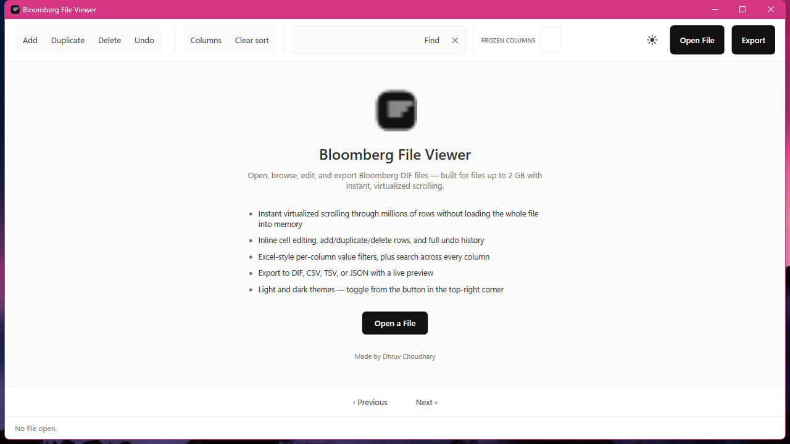

# Bloomberg File Viewer

[](https://github.com/Dhruvch1244/File-Viewer/actions/workflows/ci.yml)

A native Windows (.NET 8 / WPF) desktop app for opening, browsing, editing, and exporting
Bloomberg DIF/GETDATA files — built to stay responsive on files up to 2 GB, with instant
virtualized scrolling instead of loading the whole file into memory.



## Features

- **Handles large files without stalling.** Indexing runs on a background thread with progress
  reporting; the grid only ever decodes the rows currently on screen, backed by an unmanaged
  (non-GC-heap) row index and an LRU decoded-row cache. Filtering is a single parallel pass that
  evaluates every active filter at once — see [How filtering stays fast](#how-filtering-stays-fast).
- **Inline editing with full undo.** Edit any cell, add/duplicate/delete rows, bulk-delete a
  selection, and undo any of it — edits are tracked as an overlay on top of the original file, so
  the source file is never mutated until you export.
- **Excel-style column filtering.** Click a column header to see the distinct values present in
  that column and filter by them directly, without needing to already know what values exist.
  Double-click a header to sort by it instead.
- **Search with as many terms as you need.** Each term carries its own scope (all columns, or one
  named column), comparison (contains / does not contain / is / is not / starts with / ends with /
  regex) and case sensitivity. "Find" searches with just the term you typed; "+ Add term" keeps the
  terms already applied and adds this one, and the match-all/match-any toggle decides whether a row
  has to satisfy every term or just one. Every active term shows as a chip you can remove on its own.
- **Several files open at once, as tabs.** Each tab has its own rows, edits, sort, filters and
  column layout, so comparing two files doesn't mean reopening one to look at the other.
- **Bulk (multi-section) files, detected automatically.** A bulk export repeats the whole
  `START-OF-FIELDS` … `END-OF-DATA` block once per requested field, each block naming itself with a
  `DATA=<something>` attribute and declaring its own columns. Open one and every section appears in
  a section bar, each as its own table. Detection is by content as well as by the "bulk" naming
  convention, so a bulk file that isn't named like one still opens correctly. Sections are indexed
  the first time you open them, not when the file opens — a ten-section file costs one structural
  scan plus the sections you actually look at. Exporting shows only the section you're on, written
  as an ordinary single-section DIF file.
- **Select at scale.** A "select all" that spans every row matching the current filters — not just
  the page currently on screen — so bulk actions act on the full result set.
- **Multi-format export.** Export to DIF, CSV, TSV, or JSON with a live preview of the first rows,
  reflecting your current edits, sort, and filters.
- **Light and dark themes**, toggled from the button in the toolbar.
- **No content validation gate.** The app shows records as they are in the file; it doesn't reject
  or flag rows for looking "malformed" — only structural file-format issues (e.g. a missing
  section marker) are surfaced as diagnostics.

## How filtering stays fast

Filtering is the one operation that has to look at rows the grid isn't showing, so it is where the
app either feels instant or doesn't. Four things it does:

- **One pass, not one per filter.** The search terms and every column filter are compiled together
  into a single predicate set, so a row is read once and judged once instead of surviving one filter
  only to be re-read by the next.
- **Reject on bytes before decoding.** A plain substring term over all columns is answered directly
  against the row's UTF-8 bytes (case-folded for ASCII), so rows that can't match are never split
  into fields or turned into strings. Only what survives that is decoded — which is what keeps a
  selective term cheap even when it's combined with column filters that do need decoded values.
- **Read like the file is laid out.** Rows are contiguous on disk, so a scan in file order is really
  a sequential read. Workers pull the file in 1 MB runs and serve rows out of that buffer rather than
  issuing a read per row; a scan in some other order (after an arbitrary-column sort) falls back to
  per-row reads automatically.
- **Spread across cores, cancel when stale.** Row reads are independent, so the scan is partitioned
  across cores and the results concatenated in partition order (which is the input order). The edit
  overlay is read from a lock-free snapshot rather than taking its lock twice per row, and a scan
  whose result nothing will read any more — the tab was closed, the filter changed — is cancelled
  rather than left to finish.

Measured on a synthetic 82 MB file (2,000,000 rows, 4-core container), against the previous
implementations of the same operations run back-to-back on the same machine and file:

| Operation                                       |  Before |  After |
| ----------------------------------------------- | ------: | -----: |
| Search all columns for a substring               | 1446 ms |  17 ms |
| Search one named column (forces full decoding)   | 1574 ms | 333 ms |
| Search term + two column filters together        | 1659 ms |  52 ms |
| Distinct values of a column (the filter popup)   | 1480 ms | 493 ms |

Run `benchmarks/FileViewer.Benchmarks` for the maintained versions of these measurements.

## Project layout

```
src/FileViewer.Core/    Format parsing, indexing, editing, sorting/filtering, export — no UI code
src/FileViewer.App/     WPF UI: the virtualized grid, view models, dialogs, theming
tests/FileViewer.Core.Tests/   xUnit tests for FileViewer.Core
benchmarks/FileViewer.Benchmarks/   BenchmarkDotNet suite (see its own README)
```

`FileViewer.Core` has no dependency on WPF or any UI framework — it's a plain library, so the
indexing/editing/export logic is independently testable and could back a different front end later.

## Building and running

Requires the .NET 8 SDK (or newer, as long as `net8.0` / `net8.0-windows` targets are available).

```
dotnet build FileViewer.slnx
dotnet run --project src/FileViewer.App
```

## Running tests

```
dotnet test tests/FileViewer.Core.Tests
```

## Publishing a release build

```
pwsh ./build-release.ps1
```

This produces a self-contained, single-file, ReadyToRun `win-x64` build of `FileViewer.App` — no
.NET runtime install required on the machine that runs it — and zips it up at
`release/FileViewer-win-x64.zip`. To do it by hand instead:

```
dotnet publish src/FileViewer.App -c Release -r win-x64 -o publish/FileViewer-win-x64
```

## CI/CD

- **CI** (`.github/workflows/ci.yml`) runs on every push and pull request: builds `FileViewer.App`
  and the benchmarks project, and runs the `FileViewer.Core` test suite on a Windows runner.
- **Release** (`.github/workflows/release.yml`) builds and attaches a downloadable
  `FileViewer-win-x64.zip` to a GitHub Release. It runs automatically when you push a tag matching
  `v*.*.*`:

  ```
  git tag v0.1.0
  git push origin v0.1.0
  ```

  or manually from the Actions tab (`Release` → `Run workflow`) against any branch, if you want a
  build without cutting a version tag.

### Code signing (avoiding the "Unknown Publisher" warning)

Release builds aren't code-signed, so Windows SmartScreen flags the exe as "Unknown Publisher" —
this is expected for an indie/unsigned build. On the SmartScreen dialog, click **More info** →
**Run anyway**; that's safe for a build you compiled yourself or downloaded from this repo's own
Releases page.

To make the warning go away for good, some options (roughly cheapest/least-effort to most):
- **Self-signed certificate** — free, removes the "Unknown Publisher" text in favor of your own
  name, but SmartScreen still warns on any machine that hasn't explicitly trusted your certificate.
  Really only useful for your own machines.
- **A CA-issued code signing certificate** (OV or EV, from a provider like DigiCert or SSL.com) —
  the real fix; costs roughly $70–400+/year. EV certs get instant SmartScreen trust; OV certs build
  up trust over time as more people download the signed exe.
- **Distribute via the Microsoft Store** — packaging as MSIX and publishing through the Store
  (one-time developer account fee) sidesteps SmartScreen entirely, since Store-installed apps are
  already vetted by Microsoft's submission process.

## Benchmarks

See [`benchmarks/FileViewer.Benchmarks/README.md`](benchmarks/FileViewer.Benchmarks/README.md) for
the BenchmarkDotNet suite covering indexing, scrolling, sort/filter, and export throughput.

---

Made by Dhruv Choudhary.
